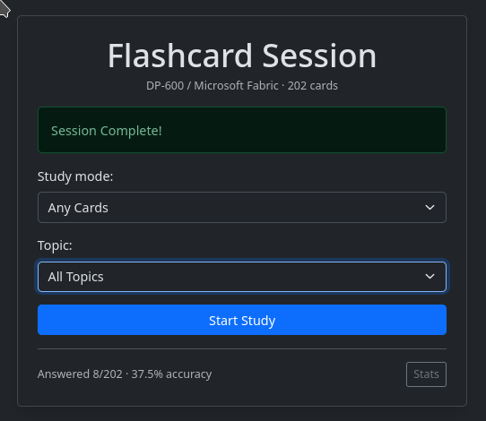
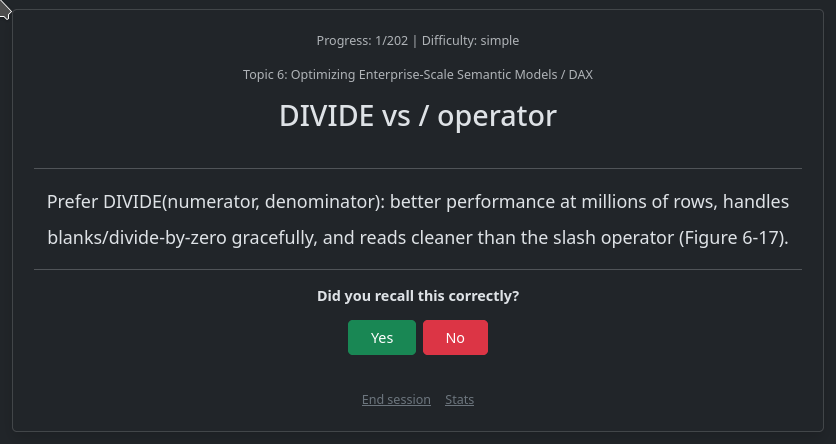
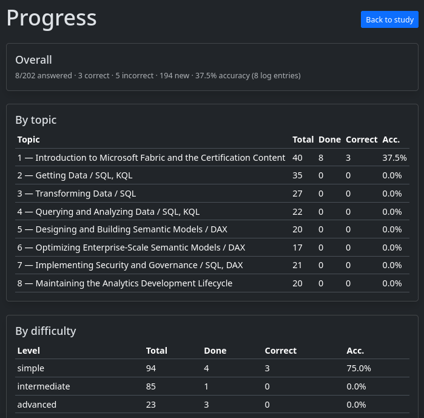

# Flashcard Pro — DP-600 Exam Trainer

Flask-based self-study flashcard app for the **Microsoft DP-600: Implementing Analytics Solutions Using Microsoft Fabric** certification.



Active recall workflow: pick mode + topic → see a term → try to recall → reveal definition → self-grade Yes/No → next card. Results persist to JSON for spaced review (`new` / `incorrect` modes). A `/stats` page shows accuracy overall, per topic and per difficulty.

## Stack

- Python 3 + Flask (Jinja templates, server-side session)
- Bootstrap 5.3 (dark theme via CDN)
- File-based JSON storage — no database

## Quickstart

```bash
pip install -r requirements.txt
python app.py
# open http://127.0.0.1:8001/
```

Config via env vars:

```bash
SECRET_KEY=... FLASK_DEBUG=1 PORT=8001 python app.py
```

- `SECRET_KEY`: Flask session key (default `dev-secret-change-me`).
- `FLASK_DEBUG=1`: enable debug reload (default off).
- `PORT`: default `8001`.

## Usage

1. On `/` select a **mode** and **topic**, click **Start Study**.
2. On `/quiz` read the term + topic, click **Show Definition**.
3. Click **Yes** (recalled) or **No** (missed). POSTs to `/answer` and advances.
4. After the last card you return to `/` with `Session Complete!`.
5. Visit `/stats` for progress, `/end` to abort a session early.

Modes:

| Mode | Meaning |
|------|---------|
| `any` | All cards (optionally topic-filtered) |
| `new` | Never answered |
| `incorrect` | Last attempt was `correct=0` |
| `simple` / `intermediate` / `advanced` | Filter by `difficulty` |

Topics: dropdown of all 8 DP-600 domains from `topics.json` + `All Topics`.
Legacy `medium`/`hard` values are accepted as aliases for `intermediate`/`advanced`.





## Project Structure

```
app.py               # routes: /, /start, /quiz, /answer, /end, /stats
data_manager.py      # load/filter/stats/compaction helpers
templates/
  index.html         # mode + topic picker, progress summary
  quiz.html          # term -> reveal -> Yes/No
  stats.html         # overall / by-topic / by-difficulty tables
static/favicon.ico
topics.json          # 8 DP-600 topics
flashcards.json      # 202 merged cards (from flashcards1-8.json)
flashcards1-8.json   # per-topic source files (kept for reference)
results.json         # answer log: {id, correct, timestamp}
requirements.txt     # Flask>=3.0
test_data_manager.py # unittest suite (7 tests)
```

Dataset: 202 cards (94 simple / 85 intermediate / 23 advanced) across topics 1-8.

Card schema:

```json
{"id": 101, "topic_id": 1, "difficulty": "simple", "term": "...", "definition": "..."}
```

Result entry:

```json
{"id": 121, "correct": 0, "timestamp": "2026-10-05T09:23:51.793081"}
```

## Tests

```bash
python -m unittest test_data_manager -v
```

Covers: any/difficulty/topic filtering, legacy aliases, new/incorrect lifecycle, stats, compaction.

## Notes

- `results.json` auto-compacts to latest-entry-per-card past 5000 entries (`compact_results()`).
- Session state (`quiz_stack`, `current_index`) lives in a signed cookie — clearing cookies resets progress. Stale card IDs are skipped.
- Single-user, no auth. Jinja autoescape mitigates XSS.
